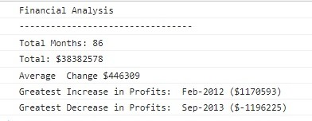

# Console-Finances

## Description

Hello, this is my first JavaScript project. Printing a small financial analisys report in the console. You can view the code by following the link to my repo: 
https://github.com/NikSimeonov/Console-Finances.git.

You can also view the live version on the following link:
https://niksimeonov.github.io/Console-Finances/

    

## Project is created with:

HTML5, JavaScript

## Instalation

N/A

## Usage

For everyone to use

## Credits

N/A

## Licence

Please refer to my repo!